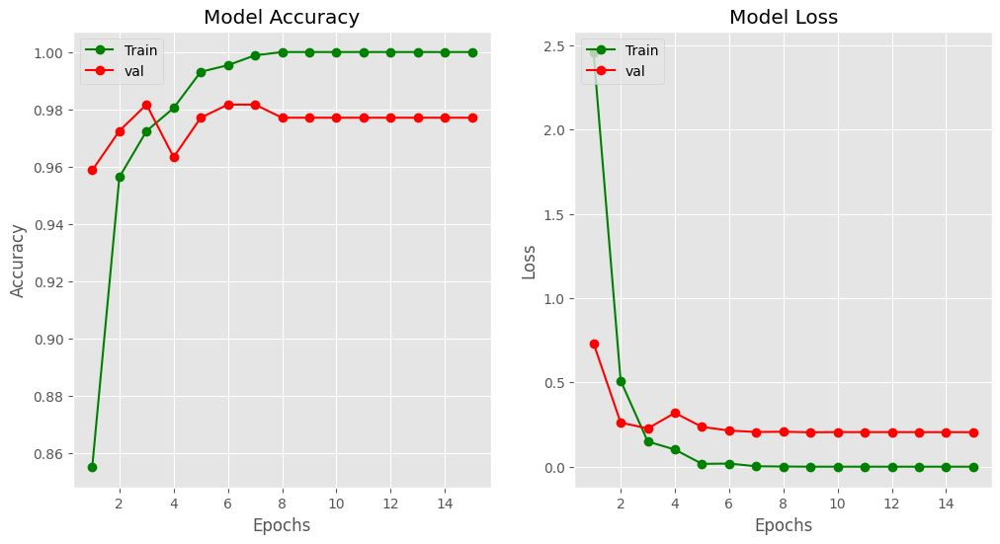

# Cataract Disease Recognition

Cataracts are a common age-related eye condition that can significantly impact vision quality if left untreated. Early detection of cataracts is crucial for timely intervention and effective management. This project presents an automated cataract detection system utilizing machine learning techniques to assist ophthalmologists in diagnosing cataracts accurately and efficiently.

##  Background and Literature Review

Cataracts are characterized by the clouding of the eye's natural lens, resulting in blurred vision, glare, and decreased visual acuity. According to the World Health Organization (WHO), cataracts are a leading cause of vision impairment worldwide, particularly among the elderly population.

Existing literature on cataract detection predominantly revolves around manual assessment by ophthalmologists and image-based analysis using computer-aided diagnostic systems. Various studies have explored the use of machine learning algorithms, including deep learning models, for automated cataract detection from fundus images and optical coherence tomography (OCT) scans.
## Methodology

The cataract detection program follows a multi-step methodology:

1. Importing Libraries

    ```bash
    import numpy as np
    import pandas as pd
    import os
    import cv2
    import random 
    from tqdm import tqdm
    import sklearn
    import matplotlib.pyplot as plt
    import tensorflow as tf
    from tensorflow.keras.preprocessing.image import ImageDataGenerator
    ```
2. Data preprocessing

The Ocular Disease Recognition dataset (ODIR-5K) is a comprehensive collection of fundus images curated for the purpose of ocular disease detection and classification.
The dataset contains a total of 5,000 fundus images, representing a diverse range of ocular conditions and disease states.
Each fundus image is labeled with diagnostic keywords, providing information about the presence of ocular diseases such as cataracts, diabetic retinopathy, glaucoma, hypertensive retinopathy, myopia, macular degeneration, and drusen.

From the original dataset, a subset of fundus images is extracted based on the presence of normal or cataract conditions.Images are filtered and categorized into normal and cataract classes using diagnostic keywords and labels provided in the dataset.

Prior to model training, the dataset undergoes preprocessing steps to standardize image dimensions, and is partitioned into training and test sets for model development and evaluation, respectively.

3. Data Visulation

Here are some images form the dataset:


4. Machine learning model development

    Base Model Selection:
    The VGG19 architecture, pretrained on the ImageNet dataset, is chosen as the base model for feature extraction. VGG19 is a convolutional neural network (CNN) known for its deep architecture and excellent performance in image classification tasks.
    
    

    Transfer Learning:
    Transfer learning is employed by utilizing the pre-trained VGG19 model as a feature extractor. By setting include_top=False, the fully connected layers at the top of the VGG19 model are excluded, allowing it to be used as a feature extractor while preserving the convolutional base.

    Freezing Layers:
    All layers of the VGG19 model are set to non-trainable (layer.trainable = False) to prevent their weights from being updated during training. This step ensures that the pre-trained features learned from ImageNet remain unchanged and serves as a fixed feature extractor.

    Model Architecture:
    A Sequential model is constructed to build the final classification model. The VGG19 base model is added as the first layer, followed by a Flatten() layer to flatten the extracted features into a one-dimensional vector.
    A fully connected Dense layer with a single neuron and sigmoid activation function is added as the output layer. This layer produces a probability score indicating the likelihood of the input image belonging to the cataract class.
    
    Model Compilation:
    The model is compiled using the Adam optimizer, a popular choice for training deep learning models. The binary cross-entropy loss function is selected as it is well-suited for binary classification tasks, such as cataract detection.
    The accuracy metric is specified to monitor the performance of the model during training and evaluation.
    
    Summary:
    The resulting model architecture consists of a VGG19 base model followed by a fully connected layer with sigmoid activation, creating an end-to-end binary classification model for cataract detection.
    

 

## Results

After training the cataract detection model for 15 epochs, the following results were obtained:
- Training Loss: 3.8405e-05
- Training Accuracy: 100.00%
- Validation Loss: 0.2050
- Validation Accuracy: 97.71%

A confusion matrix was generated to evaluate the model's classification performance. It provides a comprehensive overview of the model's predictions compared to the ground truth labels.


Additionally, learning curves were plotted to visualize the model's training progress over epochs:



Lets now make some predictions on new images:


## Conclusion

The cataract detection model demonstrates outstanding performance, achieving near-perfect accuracy on the training dataset and maintaining high accuracy on the validation dataset. The plotted confusion matrix provides detailed information about the model's classification outcomes, while the learning curves offer visualizations of the training dynamics. Overall, the results indicate the effectiveness of the developed model in accurately distinguishing between cataract and non-cataract fundus images.